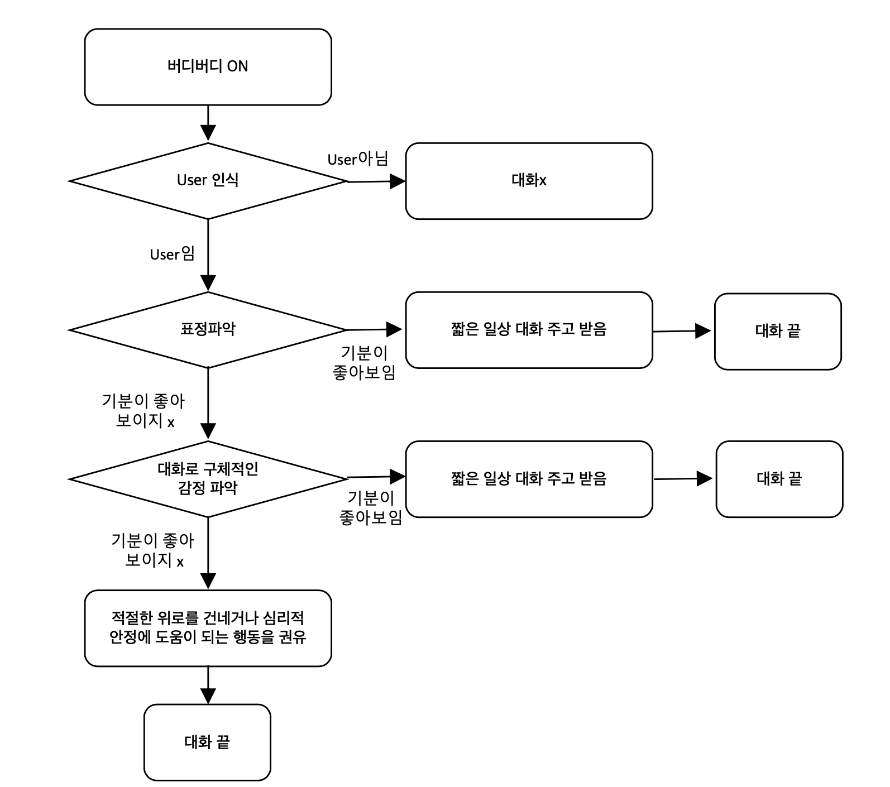

# 딥러닝 기반 심리안정 음성챗봇 "Buddy"

학교다니기힘드시조 유튜브 채널
----------------------
Link: 

Prototype
----------------------
학교다니기힘드시조 버디 프로토타입 영상: 

Check List
----------------------
[Buddy Model 개발 전]
> - [x] Protortype 영상: 
> - [ ] `Multi-Speaker-Tacotron Data` 전처리
> - [ ] `Multi-Speaker-Tacotron Data` `Deep-Voice` 학습
> - [ ] KoBERT 모델 일반 대화 학습

[Buddy Model 개발]
> - [x] 얼굴인식 API 삽입
> - [x] STT API 삽입
> - [ ] 가상서버 or 드라이브 만들기
> - [ ] 학습시킨 Model을 API 형태로 서비스화 하기
> - [ ] 각 Output들이 서로의 Input이 되도록 코드 연결 
> - [ ] Raspberry Pi 탑재

[Model 완성 후]
> - [ ] 스피커 3D 디자인 모델링
> - [ ] 스피커 3D Printing
> - [ ] PIR 센서 감도 조작
> - [ ] 스피커 제작

Buddy Project
----------------------

### Poroject Repository

Dev repository: https://github.com/LeeJungA43/Chatbot_Buddy

Multi-Speaker Tacotron 모델: https://github.com/LeeJungA43/mstt

KoBERT를 활용한 채팅봇 모델: https://github.com/LeeJungA43/buddy_KoBERT

### 프로젝트의 목적

>기본적으로 현대 청년층의 심리장애 및 우울증 환자 수가 증가하고 있고, 이것이 코로나시대와 겹쳐지면서 '코로나 블루'라는 신조어까지 생기는 상황이다. 이러한 우울증이 병원에 갈 수 없는 한밤중이나 휴일에 심해질 때, 그 곁에서 불안정한 심신을 위로하고 우울감을 조절할 수 있는 조언을 해줄 수 있는 스피커가 있다면 효과적일 것이라 생각했다.
>
>그래서 생각해낸 것이 바로 딥러닝 기반 음성챗봇이다. AIhub에서 제공하는 '웰니스 대화 스크립트 데이터셋'을 사용하여 챗봇을 학습을 시킨다면 우울함을 겪고 있는 사용자에게 적절한 위로의 대답을 할 수 있을 것이라 생각했다. 그리고 텍스트로 대화하는 것 보다는, 실제 음성으로 대화를 하면 더욱 심신 안정에 효과적일 것이라 생각하여 음성챗봇으로 구현하기로 결정했다.

### Project Flow-Chart

###Senario

1. 적외선 센서로 사용자의 인기척 감지
2. 사용자 판단 후 표정 촬영
3. 필요 소리(사용자의 발화) 분류
4. 모델을 통해 답변 출력

###Reference

Multi-Speaker-Tacotron: https://github.com/carpedm20/multi-speaker-tacotron-tensorflow

cognitive-services-speech-sdk: https://github.com/Azure-Samples/cognitive-services-speech-sdk

azure-sdk-for-python: https://github.com/Azure/azure-sdk-for-python/tree/master/sdk/cognitiveservices/azure-cognitiveservices-vision-face

WellnessConversation-LanguageModel: https://github.com/nawnoes/WellnessConversation-LanguageModel

